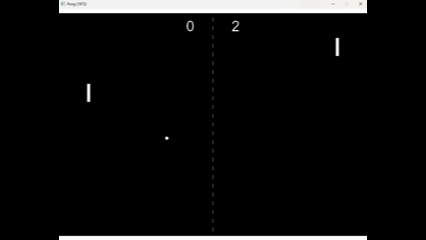

<h1 align="center">
  <br>
  
  <br>
  Ludus
  <br>
</h1>

<h4 align="center">
  A lightweight <b>C++</b> game framework powered by <b>OpenGL</b>.
</h4>

<p align="center">
  
  
  
  
  
</p>

<p align="center"><i>A personal experiment in graphics, physics, and engine architecture design.</i></p>

## Overview
**Ludus** is a graphics library and game framework written in C++ with **OpenGL** as its rendering backend.

Its goal is to evolve into a complete game engine supporting both **2D and 3D** projects — and eventually include a **game editor**.

## Features (v0.1.0)

### Ludus::Engine
- Core registries for game objects, transforms, and colliders.
- Scene and object management.
- Deterministic time-step and timer system.
- Random number generator with seed control.
- Layer-based collision filtering.
- Debug and assert macros.

### Ludus::Graphics
- 2D renderer for quads, circles, lines, and text.
- Shader, texture, and buffer abstractions.
- Color utilities and camera system.
- Text alignment and glyph rendering.

### Ludus::Math
- Vector, transform, and shape primitives.
- Numeric constants and math utilities.

### Ludus::Physics
- AABB collision with MTV resolution.
- Broadphase and narrowphase steps.
- Contact information structures.

### Ludus::Platform
- Window creation and configuration.
- Keyboard and input handling.

### Infrastructure
- Unit testing with [GoogleTest](https://github.com/google/googletest).
- Continuous integration via GitHub Actions.
- Semantic versioning and structured project flow.

### Demo Game — Pong (1972)
- Built entirely using Ludus systems.
- Deterministic gameplay loop.
- Game states: **Menu -> Playing -> Paused -> Score**.
- Singleplayer AI and local multiplayer.

<p align="center">
  
</p>


## Building Ludus

### Requirements
- Visual Studio 2022 (v17+) with MSVC toolset v143.
- Git.

### Build Instructions
```bash
# Clone the repository.
git clone https://github.com/TordLoefgren/Ludus.git
cd Ludus

# Open and build in Visual Studio.
Ludus.sln
```

## Inspiration & References
This project draws ideas from great resources in the C++ and graphics programming community:

- **The Cherno** – _Game engine series_  
  https://www.youtube.com/@TheCherno
- **Games with Gabe** – _Coding a 2D Physics Engine series_  
  https://www.youtube.com/@GamesWithGabe
- **LearnOpenGL** – _Modern OpenGL concepts (shaders, VAOs/VBOs, texturing)_  
  https://learnopengl.com/
- **Gaffer on Games** – _Fix-your-timestep, networking, and simulation articles_  
  https://gafferongames.com/
- **Box2D Lite / Erin Catto Notes** – _Collision detection and resolution fundamentals_  
  https://box2d.org/
- **Game Programming Patterns** – _Design and architecture approaches for game development_  
  https://gameprogrammingpatterns.com/
- **IndieGameDev.net** – _Articles, tutorials, and insights on game architecture and engine design_  
  https://indiegamedev.net/
- **GoogleTest** – _Unit testing library used in Ludus_
  https://github.com/google/googletest
- **GLFW / OpenGL References** – _Windowing, input, and API specifications_  
  https://www.glfw.org/ · https://www.khronos.org/opengl/


