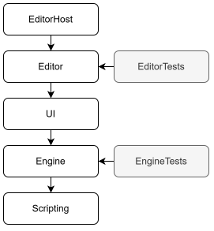
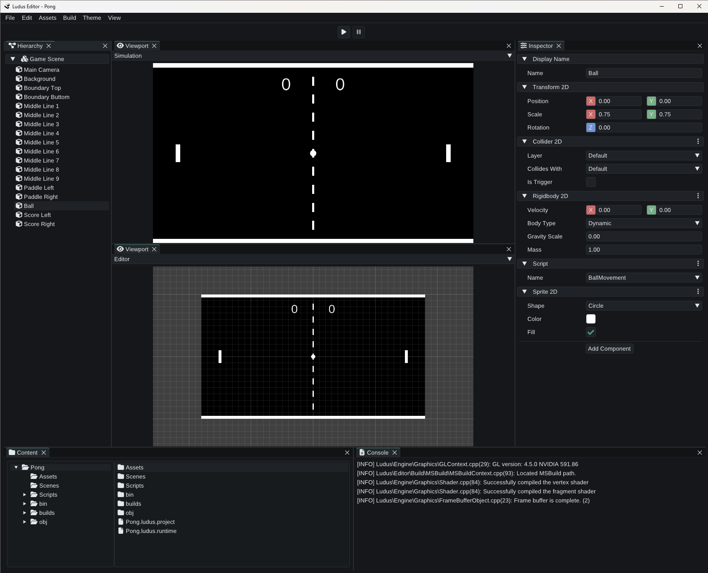

<h1 align="center">
  <br>
  
</h1>

<p align="center">
  
  
  
  
  
  
</p>


<p align="center"><i>
A personal experiment in graphics, physics, and engine architecture design.
</i></p>


## Overview

**Ludus** is a **C++** game engine and integrated editor built as a long-term learning and portfolio project.

Right now, Ludus is focused on **2D** engine and editor development, with **3D** support planned later. It serves as a space to explore rendering, editor tooling, data-driven architecture, and physics systems.


## Architecture

Ludus is organized as a layered stack:

- `EditorHost` serves as the desktop application shell
- `Editor` adds tools for creating and editing content
- `UI` provides shared user interface components for the editor
- `Engine` is the runtime core
- `Scripting` defines the script-facing application programming interface (API) and application binary interface (ABI)

The diagram below shows a simplified view of the repository structure.


<p align="center">
  
</p>

<p align="center"><i>
Simplified dependency view of the repository, showing the main architectural layers and their test projects rather than every direct project reference.
</i></p>


## Current Snapshot

Ludus is in active development and currently focused on **2D** engine and editor features. Simple projects such as Pong can be created in the editor and exported as runnable Windows builds.

Selected highlights introduced in version **0.3.0**:

- a more consistent and easier-to-use editor, with improved project access, saving, and persistence
- generated C++ scripting projects that can be opened, modified, and built from the editor
- scripts that can be attached to entities and executed while simulating a project
- standalone Windows games that can be built and packaged from the editor
- texture files that can be added to projects and used on sprites

<p align="center">
  
</p>

<p align="center"><i>
Pong created in the editor and exported as a runnable Windows build.
</i></p>


## Quick Start

```cmd
git clone https://github.com/TordLoefgren/Ludus.git
cd Ludus
msbuild .\Ludus.sln /m /p:Configuration=Debug /p:Platform=x64 /p:VcpkgEnableManifest=true
```

After building, run `EditorHost` from the selected output directory.


## Requirements

- Windows 10/11
- Visual Studio 2026
- Desktop development with C++
- MSVC Build Tools v145
- Windows SDK
- `vcpkg`


## Inspiration & References
This project is influenced by several resources from the C++ and graphics programming community:

- **Cem Yuksel / University of Utah** – _Introduction to Computer Graphics lecture series_<br>
  https://www.youtube.com/playlist?list=PLplnkTzzqsZTfYh4UbhLGpI5kGd5oW_Hh
- **The Cherno** – _Game engine series_  
  https://www.youtube.com/@TheCherno
- **Games with Gabe** – _Coding a 2D Physics Engine series_  
  https://www.youtube.com/@GamesWithGabe
- **LearnOpenGL** – _Modern OpenGL concepts (shaders, VAOs/VBOs, texturing)_  
  https://learnopengl.com/
- **Gaffer on Games** – _Fix-your-timestep, networking, and simulation articles_  
  https://gafferongames.com/
- **Box2D Lite / Erin Catto Notes** – _Collision detection and resolution fundamentals_  
  https://box2d.org/
- **Game Programming Patterns** – _Design and architecture approaches for game development_  
  https://gameprogrammingpatterns.com/
- **IndieGameDev.net** – _Articles, tutorials, and insights on game architecture and engine design_  
  https://indiegamedev.net/
- **GLFW / OpenGL References** – _Windowing, input, and API specifications_  
  https://www.glfw.org/ · https://www.khronos.org/opengl/
