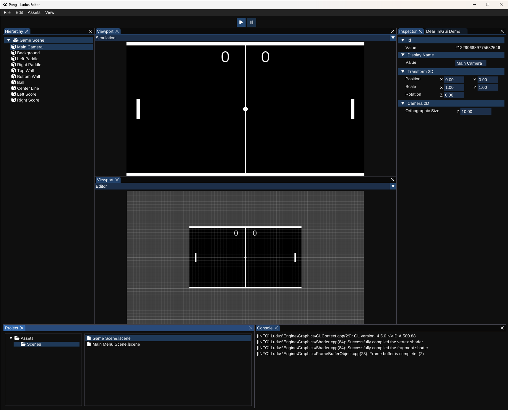

<h1 align="center">
  <br>
  
</h1>

<p align="center">
  
  
  
  
  
</p>

<p align="center"><i>
A personal experiment in graphics, physics, and engine architecture design.
</i></p>


## Overview

**Ludus** is a C++ game engine with an integrated editor, developed as a long-term learning and portfolio project.

Rather than aiming for a finished engine product, the goal is to explore and understand:
- Rendering systems
- Editor tooling
- Data-driven architecture
- Physics pipelines, simulation systems, and geometry-focused workflows

Ludus currently targets **2D**, with a clear intent to add **3D** support later.


## Architecture

Ludus follows a layered architecture separating:

- **Engine**: Runtime systems used by games (rendering, ECS/component workflows, physics, persistence, and platform abstractions).
- **Editor**: A desktop tooling application built on top of the engine runtime (panels, inspectors, and scene/project workflows).
- **UI**: Reusable Dear ImGui abstraction and utility layer used by editor tooling.

This separation is enforced throughout rendering, input, persistence, and tooling systems.


## Editor (Current State)

The editor is built on **Dear ImGui** and follows a layered architecture clearly separating UI, editor logic, and engine runtime.
It is a client of the engine runtime, not part of the runtime itself.

Implemented or in active development:
- Dockable panel system (Hierarchy, Viewport, Inspector, Console, Project).
- Scene hierarchy and entity inspection.
- Component-based editing.
- Orthographic camera and 2D viewport rendering.
- Basic extensible physics pipeline.
- Event system.
- Explicit control over framebuffers.
- Project and scene serialization with persistence layer.
- Logging, assertions, and debug tooling.

<figure>
  
  <figcaption><i>Editor view while iterating on core engine systems.</i></figcaption>
</figure>


## Project Status

Ludus is **not yet distributed**.

Its goal is to evolve into a complete game engine supporting both **2D and 3D** projects — and eventually include a **game editor**.

## Features (v0.1.0)

### Ludus::Engine
- Core registries for game objects, transforms, and colliders.
- Scene and object management.
- Deterministic time-step and timer system.
- Layer-based collision filtering.
- Debug and assert macros.

This repository exists primarily as a **technical portfolio** and architectural exploration.


## Tech Highlights

- Engine stack: C++20, OpenGL rendering backend, custom math library, extensible physics and event systems, custom serialization / persistence system.
- Editor stack: Dear ImGui–based editor.
- Testing: GoogleTest.


## Repository Structure

```text
Engine/   -> Runtime code
Editor/   -> Editor application
UI/       -> Shared UI layer
Tests/    -> Automated tests
```


## Building

Prerequisites:
- Windows 10/11
- Visual Studio 2022
- Desktop development with C++
- C++20 toolset

```bash
git clone https://github.com/TordLoefgren/Ludus.git
cd Ludus

# Install vcpkg (if not already installed)
git clone https://github.com/microsoft/vcpkg C:\dev\tools\vcpkg
C:\dev\tools\vcpkg\bootstrap-vcpkg.bat

# Configure vcpkg for this shell
set VCPKG_ROOT=C:\dev\tools\vcpkg
set VCPKG_DEFAULT_TRIPLET=x64-windows

# Bootstrap dependencies (manifest mode)
%VCPKG_ROOT%\vcpkg.exe install --triplet x64-windows --x-manifest-root=. --x-install-root=.cache\vcpkg_installed

# Build
msbuild .\Ludus.sln /m /p:Configuration=Debug /p:Platform=x64 /p:VcpkgEnableManifest=true
```

Notes:
- The repository uses `vcpkg.json` + `vcpkg-configuration.json` to pin dependencies.
- To force usage of tools already installed on your machine (git/cmake/ninja from PATH), set:
```powershell
$env:VCPKG_FORCE_SYSTEM_BINARIES = "1"
```
- If needed, persist local vcpkg environment variables once:
```powershell
setx VCPKG_ROOT "C:\dev\tools\vcpkg"
setx VCPKG_DEFAULT_TRIPLET "x64-windows"
```

## Running Tests

Option 1 (Visual Studio):
- Open `Ludus.sln`
- Select `Debug|x64` (or `Release|x64`)
- Build the `Tests` project
- Run tests from Test Explorer

Option 2 (command line):
```powershell
msbuild .\Tests\Tests.vcxproj /m /p:Configuration=Debug /p:Platform=x64
.\Tests\bin\x64\Debug\Tests.exe
```

Logs are written to `.cache\logs\` instead of repository root.

## Inspiration & References
This project draws ideas from great resources in the C++ and graphics programming community:

- **The Cherno** – _Game engine series_  
  https://www.youtube.com/@TheCherno
- **Games with Gabe** – _Coding a 2D Physics Engine series_  
  https://www.youtube.com/@GamesWithGabe
- **LearnOpenGL** – _Modern OpenGL concepts (shaders, VAOs/VBOs, texturing)_  
  https://learnopengl.com/
- **Gaffer on Games** – _Fix-your-timestep, networking, and simulation articles_  
  https://gafferongames.com/
- **Box2D Lite / Erin Catto Notes** – _Collision detection and resolution fundamentals_  
  https://box2d.org/
- **Game Programming Patterns** – _Design and architecture approaches for game development_  
  https://gameprogrammingpatterns.com/
- **IndieGameDev.net** – _Articles, tutorials, and insights on game architecture and engine design_  
  https://indiegamedev.net/
- **GoogleTest** – _Unit testing library used in Ludus_
  https://github.com/google/googletest
- **GLFW / OpenGL References** – _Windowing, input, and API specifications_  
  https://www.glfw.org/ · https://www.khronos.org/opengl/
